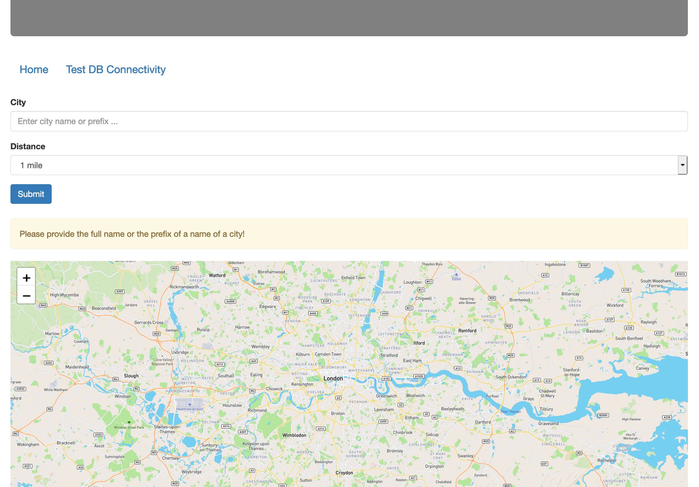
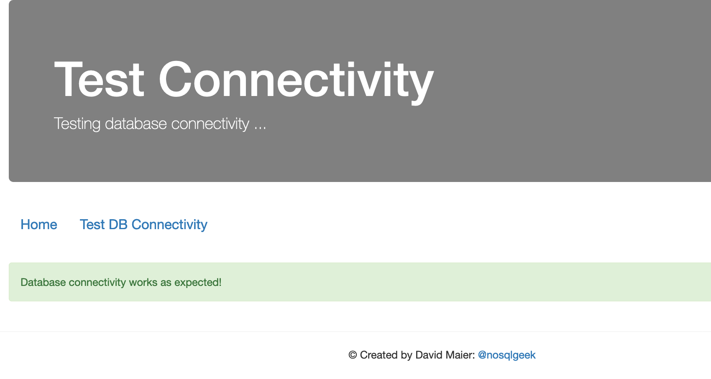
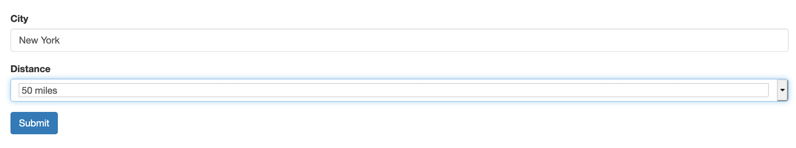
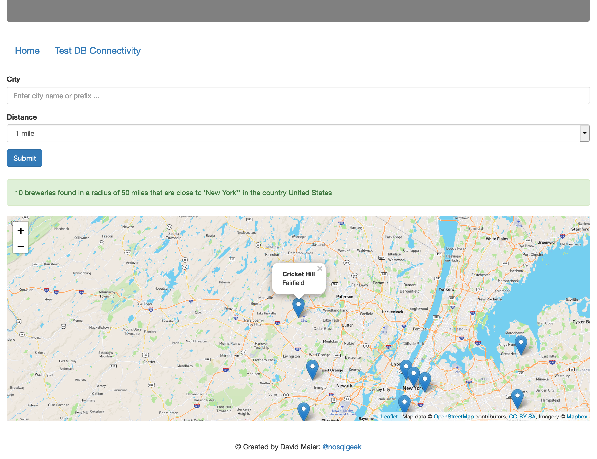

# Geolocation-Aware Applications with Redis

This repository provides some exercises around Redis commands that are related to geospatial search.

## Learning Objectives

This repository is just sharing the exercises of the 'Geolocation-Aware Applications with Redis' training. The learning objectives of the entire training are:

* Know how Geo-aware solutions are used and which problems are addressed by them
* Understand and be able to present the technology basics
* Understand the technical details of the Redis Geo* commands and their approach to support geo-spatial use cases
* Understand the data modeling basics
* Get insights how geo-spatial solutions are implemented with traditional vendors
* Know where to find additional resources about how to implement location-aware applications with Redis

## Step -Preparations

1. Ensure that your computer is connected to the internet as your computer will need to access some external resources (e.g., CCS files & JavaScript UI libraries)
2. Prepare a Python 3.x development environment! The Python dependencies need to be installed:
   1. Flask
   2. Redis
      ```
      cd geoapp
      pip install virtualenv
      virtualenv --python=python3 geoappvenv
      source geoappvenv/bin/activate
      pip install -r requirements.txt
      python --version
      ```
3. Please install Redis 6 OSS locally!
   1. No additional Redis module is required for this exercise.
4. Clone the following code repository locally: https://github.com/redislabs-training/training-geo-public ! 
   1. This results in a local working copy of the source code.
   2. Please don’t publish the source code (e.g., by forking and pushing to a public Git repo)!
5. Configure the application to use your Redis database via the file ‘config.py’!
   1. The default configuration uses port 6379.
6. Verify the database connectivity!

## Data import

1. Change the directory to the source code directory ‘geoapp’!
2. Take a look at the Python script ‘importer.py’!
3. Run the Python script ‘importer.py’ via `python importer.py`!
4. Wait until the import completes. The importer shows the message ‘Import of 16790 records completed’.
5. Which steps could be performed to speed the import up?

## Understand the source code

1. Open the file ‘app.py’ with an editor of your choice!
2. Read and understand the source code!
   1. The file is just 125 lines of code long.


## Implementation tasks

The idea of this exercise is to complete 5 simple implementation tasks. The surrounding source code is given, which should allow you to focus on the Redis commands. Each task is marked within the source code (e.g., `# Task 1 … <Your code here!>`).

### Task 1 - Scan for a city with a specific name prefix

1. You will need to identify the relevant index within the database. Indexes are prefixed with ‘idx’.
2. Please assign the result of the command to the variable ‘rs’! This variable should have the type of an ‘iterator’. The Redis-side cursor-based iteration is already implemented by the client library.

### Task 2 - Retrieve the country of the city

1. The country should be retrieved as a Python string value, and it should be assigned to the variable with the name ‘country’.
2. You can verify if Task 1 and Task 2 returned a valid result by looking at the debug output: `DEBUG: id = {}, city = {}, country = {}`

### Task 3 - Retrieve the coordinates of the city

1. You will need to identify the index within the database, which holds the geo-coordinates of cities.
2. The result of the command should be assigned to the variable ‘pos’

### Task 4 - Find max. 10 close-by breweries

1. The previously fetched city coordinates can be leveraged for finding close-by breweries.
2. You will also need to use the distance variable (dist), which was passed over as a request parameter. The distance is considered to be in miles.
3. Please construct your command in a way that ...
    1. You are NOT fetching the exact distance of resulting brewery.
    2. You are fetching the coordinates of a resulting brewery.
    3. A maximum of 10 breweries are returned (it might be otherwise hard to draw more than 10 on a map).
4. The result-set should be assigned to the variable ‘brewcoords’.

### Task 5 - Retrieve brewery details

1. The details which we retrieved in step 4 are limited to the data which was stored within the index. Please retrieve the following additional brewery details from the database!
    1. Name
    2. City
2. The result of the command is a dictionary that has the properties ‘name’ and ‘city’. The variable name for this dictionary should be ‘b’.
3. You can verify if Task 3 to 5 were completed successfully by taking a look at the debug output: `DEBUG: breweries = {}`

## Test the application

* Change the directory to the source code directory ‘geoapp’!
* Run the command  `python app.py`
* The application listens on port 5000, so you will be able to reach it via http://localhost:5500
* It’s expected to see the following:



* Click on the link ‘Test DB Connectivity’. The expected result is:



* Click on the link ‘Home’ to return to the start page again!
* Fill the form in with the following details and then press the ‘Submit’ button:
   * City: New York
   * Distance: 50 miles
   

 
* Congrats! You completed the implementation exercise successfully if you are seeing the following output:


